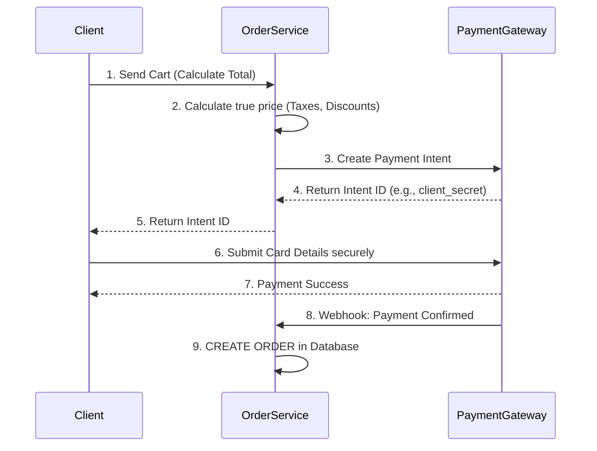

# Order Service System Design

## 1. Checkout & Order Flow

### Why decouple Price Calculation from Order Creation?
- **Security:** Never trust frontend prices. The backend must independently calculate totals.
- **Clean DB:** Prevents cluttering the database with abandoned, unpaid, or invalid orders.
- **Payment Gateways:** Processors (like Stripe) require a pre-calculated amount to generate a "Payment Intent" before collecting card details.

### Flow Diagram

